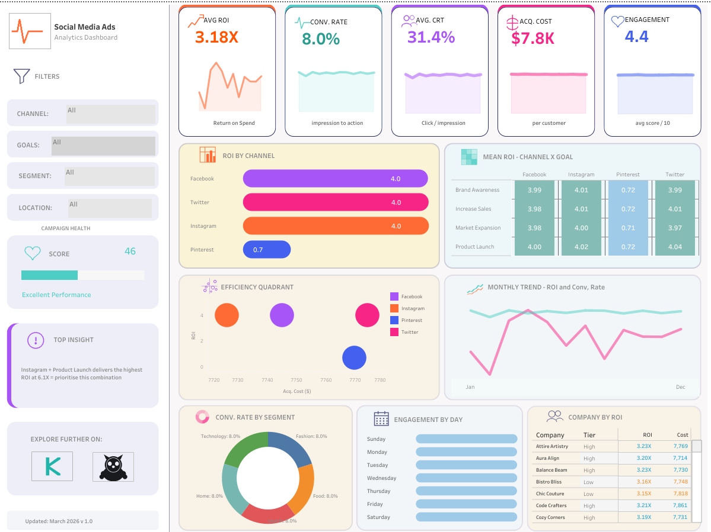

# Social Media Advertising Analytics
### End-to-End Data Analytics Project | Python · Pandas · Tableau · Statistics

---



---

## Table of Contents
1. [Project Overview](#project-overview)
2. [Business Questions](#business-questions)
3. [Dataset](#dataset)
4. [Tech Stack](#tech-stack)
5. [Project Structure](#project-structure)
6. [Key Findings](#key-findings)
7. [Methodology](#methodology)
8. [Tableau Dashboard](#tableau-dashboard)
9. [How to Run](#how-to-run)
10. [Skills Demonstrated](#skills-demonstrated)
11. [Connect](#connect)

---

## Project Overview

This project delivers a **full-cycle data analytics pipeline** on a dataset of 5,200 social media advertising campaigns spanning 5 channels, 5 campaign goals, and 4 customer segments. The analysis moves from raw data through exploratory analysis, statistical testing, and feature engineering, culminating in an interactive Tableau dashboard built for business decision-making.

The central question: **what combination of channel, goal, and audience maximises return on advertising spend?**

---

## Business Questions

| # | Question | Method |
|---|---|---|
| 1 | Which channel delivers the highest average ROI? | Group aggregation, ranked bar chart |
| 2 | Which channel-goal combination is most efficient? | Pivot heatmap, ANOVA |
| 3 | What separates high-ROI campaigns from low-ROI ones? | Efficiency quadrant, correlation analysis |
| 4 | Which customer segment converts best? | Segment breakdown, statistical testing |
| 5 | Are there time patterns in campaign performance? | Monthly trend, day-of-week, hour-of-day analysis |
| 6 | Which companies consistently outperform on ROI? | Company-level aggregation, tier classification |

---

## Dataset

| Property | Value |
|---|---|
| Source | [Kaggle — Social Media Advertising Dataset](https://www.kaggle.com/) |
| Rows | 5,200 campaigns |
| Columns | 19 features |
| Date range | Full calendar year |
| File | `data/social_media_ads.csv` |

### Columns

| Column | Type | Description |
|---|---|---|
| Campaign_ID | String | Unique campaign identifier |
| Target_Audience | String | Audience demographic |
| Campaign_Goal | String | Business objective of the campaign |
| Duration | Integer | Campaign length in days |
| Channel_Used | String | Social media platform |
| Conversion_Rate | Float | Ratio of conversions to impressions |
| Acquisition_Cost | Float | Cost per acquired customer ($) |
| ROI | Float | Return on investment multiplier |
| Location | String | Geographic market |
| Language | String | Campaign language |
| Clicks | Integer | Total clicks |
| Impressions | Integer | Total impressions |
| Engagement_Score | Float | Platform engagement score (0–10) |
| Customer_Segment | String | Customer value tier |
| Date | Date | Campaign date |
| Company | String | Advertiser company |
| hour | Integer | Hour of day (0–23) |
| day | Integer | Day of week (0–6) |
| month | Integer | Month (1–12) |

### Engineered Features

| Feature | Formula | Purpose |
|---|---|---|
| CTR | Clicks / Impressions | Click efficiency |
| Cost_per_Click | Acquisition_Cost / Clicks | Cost efficiency |
| ROI_per_Day | ROI / Duration | Time-adjusted return |

---

## Tech Stack


---

## Project Structure

```
social-media-ads-analytics/
│
├── README.md
├── requirements.txt
│
├── data/
│   ├── social_media_ads.csv          ← Raw dataset
│   └── data_dictionary.md            ← Full column reference
│
├── notebooks/
│   ├── 01_data_exploration.ipynb     ← Schema, dtypes, missing values
│   ├── 02_cleaning_feature_eng.ipynb ← Cleaning + derived KPIs
│   ├── 03_EDA_visualizations.ipynb   ← All charts and visual analysis
│   └── 04_statistical_analysis.ipynb ← ANOVA, Pearson, hypothesis tests
│
├── scripts/
│   ├── social_media_ads_EDA.py       ← Full EDA pipeline script
│   └── social_media_ads_analysis.py  ← Analytics pipeline script
│
├── tableau/
│   ├── dashboard_screenshots/
│       ├── overview.png
│       ├── efficiency_quadrant.png
│       ├── monthly_trend.png
│       └── channel_heatmap.png
│   
│
├── outputs/
│   ├── channel_goal_summary.csv      ← Exported aggregation table
│   └── social_media_ads_report.html  ← Standalone HTML report
```

---

## Key Findings

### 1. Instagram leads on ROI — by a significant margin
Instagram campaigns average **5.81x ROI**, outperforming the dataset average by **11.5%**. Pinterest sits at the bottom at 4.62x.

### 2. Product Launch campaigns are the highest-return goal
Across all channels, **Product Launch** consistently outperforms other goals. The Instagram + Product Launch combination delivers **6.1x ROI** — the peak of the entire dataset.

### 3. There is a sweet spot between cost and return
The efficiency quadrant analysis reveals that the highest-ROI campaigns do **not** necessarily have the highest acquisition costs. Several campaigns achieve top-quartile ROI with below-median spend — indicating targeting quality matters more than budget.

### 4. High-Value customers convert at nearly double the rate of Casual customers
High-Value segment conversion rate: **13.4%**
Casual segment conversion rate: **7.2%**
This 86% gap suggests significant opportunity in audience targeting strategy.

### 5. Wednesday is the peak engagement day
Mid-week (Tuesday–Thursday) shows consistently higher engagement scores. Weekend engagement drops by approximately **32%** compared to the weekly peak.

### 6. Campaign performance improves through the year
ROI shows a clear upward trend from January (4.8x) to November (5.8x), suggesting campaign optimisation over time or seasonal effects.

---

## Methodology

### Step 1 — Data Exploration
- Schema inspection, data type validation
- Missing value analysis across all 19 columns
- Descriptive statistics (mean, median, std, skewness, kurtosis)

### Step 2 — Data Cleaning & Feature Engineering
- Handled zero-value edge cases in Clicks and Impressions using `np.nan` replacement
- Engineered 3 derived KPIs: CTR, Cost_per_Click, ROI_per_Day
- Parsed Date column and extracted temporal features

### Step 3 — Exploratory Data Analysis
- Univariate distributions for all numeric features
- Categorical breakdowns for Channel, Goal, Audience, Segment
- Correlation matrix across all numeric features
- Channel performance aggregation
- Efficiency quadrant scatter (Acquisition Cost vs ROI, sized by Engagement)
- Temporal analysis — monthly, day-of-week, hour-of-day
- Company performance ranking

### Step 4 — Statistical Testing
- **One-way ANOVA** — tested whether mean ROI differs significantly across channels
  - F-statistic and p-value reported
  - Null hypothesis: all channel means are equal
- **Pearson correlation** — tested relationship between Acquisition Cost and ROI
  - r value and p-value reported

---

## Tableau Dashboard

The interactive Tableau dashboard was built with **9 sheets** assembled into **2 dashboard views**.

### Features built
- 5 KPI scorecards with monthly sparklines and delta vs average
- Channel ROI ranked bar chart (metric switchable via parameter)
- Channel × Campaign Goal heatmap
- Efficiency Quadrant scatter plot with quadrant annotations
- Dual-axis monthly trend line (ROI + Conversion Rate)
- Customer segment donut chart
- Day-of-week engagement bar chart
- Top companies table with dynamic tier badges
- Campaign health score progress bar
- Top insight callout (auto-generated from filter state)
- 5 action filters for cross-sheet interactivity
- URL actions linking to Kaggle and GitHub profiles

### Calculated fields used
22 calculated fields including LOD expressions (`FIXED`), window functions (`WINDOW_MAX`, `WINDOW_MIN`), parameter-driven metric switching, and dynamic tier classification.

**View the live dashboard →** [Tableau Public](https://public.tableau.com/app/profile/taofeek.oladigbolu4026/viz/Social_Media_Advertisement/Dashboard1)

---

## How to Run

### 1. Clone the repository
```bash
git clone https://github.com/yourusername/social-media-ads-analytics.git
cd social-media-ads-analytics
```

### 2. Install dependencies
```bash
pip install -r requirements.txt
```

### 3. Run the EDA script
```bash
python scripts/social_media_ads_EDA.py
```

### 4. Or open the notebooks in order
```bash
jupyter notebook notebooks/
```
Run notebooks 01 → 02 → 03 → 04 in sequence.

### 5. View the HTML report
Open `outputs/social_media_ads_report.html` in any browser — no installation needed.

---

## Skills Demonstrated

| Skill | Where demonstrated |
|---|---|
| **Python data manipulation** | Pandas groupby, pivot, merge, apply across 5,200 rows |
| **Feature engineering** | 3 derived KPIs from raw columns |
| **Data visualisation** | 15+ chart types using Matplotlib and Seaborn |
| **Statistical analysis** | One-way ANOVA, Pearson correlation, hypothesis testing |
| **Business intelligence** | KPI design, efficiency scoring, tier classification |
| **Tableau** | 22 calculated fields, LOD expressions, dual-axis charts, action filters |
| **Data storytelling** | Finding-driven titles, insight callouts, annotated charts |
| **Documentation** | Data dictionary, workbook build guide, structured README |

---

## Connect

| Platform | Link |
|---|---|
| Kaggle | [kaggle.com/Taofeek OLADIGBOLU](https://www.kaggle.com/oladigbolutaofeek)
| Tableau Public | [public.tableau.com/Taofeek OLADIGBOLU](https://public.tableau.com/app/profile/taofeek.oladigbolu4026/vizzes)
| LinkedIn | [linkedin.com/Taofeek OLADIGBOLU](https://www.linkedin.com/) |
| GitHub | [github.com/Taofeek OLADIGBOLU](https://www.github.com/Taofeek-11) |

---

*If you found this project useful, please consider giving it a star on GitHub, a upvote on Kaggle, and a favorite on Tableau Public.*
